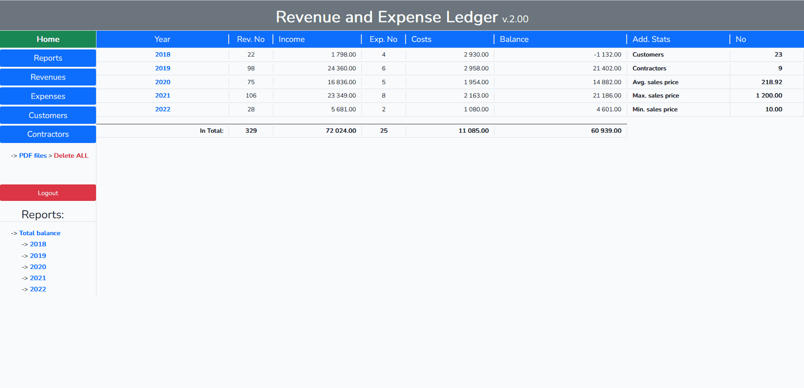

<p align="center"><a href="https://laravel.com" target="_blank"></a></p>


# Revenue and Expense Ledger

This revenue and expense ledger is built according to polish tax law intended for small business with a small range of customers. It offers total, annual and monthly balance of income/costs. REL provides also invoice creation including printing to PDF.


## Features

- Adding/editing customers and contractors
- Adding/editing revenues / expenses
- Automatic invoicing
- Printing to PDF
- Total/annual/monthly balance sheets

## Usage
In general, using the application involves working with two types of documents and balancing them. Since the program is designed for a small business, it makes sense to distinguish between clients to whom products are sold and invoiced (revenues) and clients from whom products are purchased (expenses).

Hence, the first group is _Customers_ (related to _Revenues_) and the second group is _Contractors_ (related to _Expenses_).

### Customers / Contractors
There are separate pages for both groups, where their list is presented. There are also options for editing and creating the appropriate type of document (_+Rev._ / _+Exp._)

### Revenues
Documentation of new _Revenue_ is to add revenue for the selected customer (list on the _Customers_ page). This document contains data from the application, customer data and a list of added items with their quantity and price.

While adding new revenue, the program automatically displays the documents created in a given month, suggesting the next free number for an invoice.

### Expenses
Documentation of new _Expense_ is similar, but with a selected contractor (list on the _Contractors_ page). In contrast to the revenue, the expense document contains only the total value in addition to the contractors data.

### Balance sheets
The _Reports_ page provides an overview of the total, annual and monthly balance sheet, where you can access all created documents, edit them and preview/print to PDF invoices (for revenues only).

## Screenshots

### Total Balance
The total balance view contains all collected data with some global statistics.



### Annual Balance
In the annual view monthly summaries are listed together.


### Monthly Balance
The monthly balance provides direct access to all revenues and expenses in the given month. In this overview there is also editing and printing to PDF (for revenues only) possible.


### Editing revenues/expenses
Expenses contain just values, while revenues are collections of items with given amount and price per unit.


### Preview / Print to PDF
Invoices are created automatically and can be previewed or printed as PDF-files.


### Customers / Contractors
Customers are those who buy products from us (related to revenues), while contractors are clients who sell to us (related to expenses).


## Architecture
All database **queries** and **CRUD operations** are located in **[Controllers](app/Http/Controllers)** folder:
```
+---app
|   |           
|   +---Http
|   |   +---Controllers
|   |   |   |   BalanceController.php
|   |   |   |   ContController.php
|   |   |   |   Controller.php
|   |   |   |   CustController.php
|   |   |   |   ExpController.php
|   |   |   |   ItemTypeController.php
|   |   |   |   PdfController.php
|   |   |   |   RevController.php
```
The application uses SQLite and the database files (used **database.sqlite** and **database_backup.sqlite**) are located in the **[database](database)** folder:
```
+---app
|       
+---database
|   |   database.sqlite
|   |   database_backup.sqlite
```
Javascript **source script-files** (before compiling assets by Laravel Mix) are located in **[resources/js](resources/js)** folder:
```
+---app
|             
+---resources
|   |       
|   +---js
|   |   |   table_highlight.js
|   |   |   
|   |   \---revenues
|   |           add_item.js
|   |           del_item.js
|   |           reorder_items.js
|   |           set_submit.js
|   |           show_invoices.js
```
Finally, all **additional classes** (custom types, database restorer and pdf builder) are located in **[Custom](app/Custom)** folder:
```
+---app
|   +---Custom
|   |   +---DB
|   |   |       DatabaseRestorer.php
|   |   |       
|   |   +---PrintDoc
|   |   |       Invoice.php
|   |   |       NumWordsConverter.php
|   |   |       PDFBuilder.php
|   |   |       SoldItem.php
|   |   |       
|   |   \---Revenues
|   |           Ity.php
|   |           
```

## What was used

- Laravel 9
- PHP 8
- SQLite
- Blade, HTML/CSS + Bootstrap 5
- Vanilla Javascript
- TCPDF

## Working version

The working version (secured with auth of Laravel, email: _user@user.com_, password: _user_) is available at:

[https://rel.deadygo.com](https://rel.deadygo.com)

### Note:
**In the version above you can change data without consequences, database file is restored from the backup at each logging-in.**
